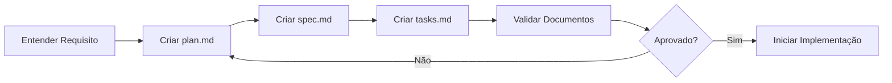
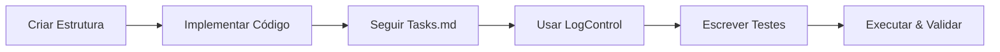

# SDD Instructions - Systematic Design & Development

## 🎯 Objetivo Central do SDD

O **SDD (Systematic Design & Development)** é uma metodologia que garante:

1. **📋 Planejamento Completo** - Pensar antes de codificar
2. **📐 Especificação Clara** - Definir exatamente o que construir
3. **✅ Execução Rastreável** - Acompanhar progresso com tasks granulares
4. **🧪 Qualidade Garantida** - Testes automatizados obrigatórios
5. **📊 Rastreabilidade Total** - Logging padronizado e auditável

**Princípio Fundamental**: *"Nunca comece a codificar sem ter SPEC → PLAN → TASKS definidos"*

---

## 📚 Índice Rápido

1. [Quando Criar uma Feature](#quando-criar-uma-feature)
2. [Fluxo de Trabalho SDD](#fluxo-de-trabalho-sdd)
3. [Estrutura de Arquivos](#estrutura-de-arquivos-obrigatória)
4. [Documentos Obrigatórios](#documentos-obrigatórios-detalhados)
5. [Padrões de Implementação](#padrões-de-implementação)
6. [Logging e Error Handling](#logging-e-error-handling-padronizados)
7. [Anti-Patterns PySpark](#anti-patterns-evite-em-pyspark)
8. [Validação e Checklist](#validação-obrigatória-checklist)
9. [Sistema de Rastreabilidade](#sistema-de-rastreabilidade-traceability)
10. [Troubleshooting](#troubleshooting-problemas-comuns)

---

## 🔍 Quando Criar uma Feature?

Use esta decision tree:

```
Você precisa criar código novo?
├─ SIM → É uma funcionalidade isolada/reutilizável?
│   ├─ SIM → CRIE UMA FEATURE (siga SDD completo)
│   └─ NÃO → É um script one-off? 
│       ├─ SIM → Crie notebook simples (sem estrutura SDD)
│       └─ NÃO → Adicione ao código de feature existente
└─ NÃO → Você está modificando feature existente?
    ├─ SIM → Atualize plan/spec/tasks + código
    └─ NÃO → Apenas executando? Siga para o notebook
```

**Exemplos de Features:**
- ✅ Ingestão de dados de uma fonte específica
- ✅ Criação de camada semântica (views/agregações)
- ✅ Transformação de dados reutilizável
- ✅ Validação de qualidade de dados
- ❌ Análise exploratória única (não é feature)
- ❌ Query SQL simples (não precisa de feature)

---

## 🔄 Fluxo de Trabalho SDD

### Fase 1: Planejamento e Design (Antes de Codificar)



**Tempo Esperado**: 30-50% do tempo total do projeto

### Fase 2: Implementação (Com Guia)



**Tempo Esperado**: 50-70% do tempo total do projeto

---

## 📁 Estrutura de Arquivos Obrigatória

```
sdd/features/<nome_feature>/
├── plan.md                         # 1️⃣ PRIMEIRO - O que e por quê
├── spec.md                         # 2️⃣ SEGUNDO - Como tecnicamente
├── tasks.md                        # 3️⃣ TERCEIRO - Checklist de execução
├── src/
│   ├── nb_<feature_name>           # 🎯 Notebook Databricks (não .py!)
│   └── tests/
│       ├── nb_test_<feature_name>  # 🧪 Notebook de testes
│       └── README.md               # Documentação dos testes
```

### ⚠️ IMPORTANTE: Notebooks vs Arquivos

**CORRETO** ✅:
- Criar notebook via `createAsset(assetType="notebook")`
- Notebooks aparecem em `/Users/<user>/<feature>/src/`
- Extensão: nenhuma (Databricks gerencia internamente)

**INCORRETO** ❌:
- Criar arquivo .py via `createAsset(assetType="file")`
- Tentar executar .py como notebook
- Usar editAsset em arquivo não-notebook

---

## 📄 Documentos Obrigatórios Detalhados

### 1️⃣ plan.md - O Plano de Implementação

**Propósito**: Definir O QUE será feito e POR QUÊ é necessário.

**Estrutura Obrigatória**:

```markdown
# Plan: <Nome da Feature>

## Propósito
[1-2 parágrafos explicando o objetivo da feature]

## Contexto de Negócio
[Explique o problema que está sendo resolvido]
[Descreva a fonte de dados ou necessidade]

## Regras de Negócio
### Regra 1: [Nome]
* Descrição clara
* Exemplo concreto
* Exceções se houver

[Repetir para cada regra]

## Estratégia de Implementação
### Abordagem Técnica
[Qual tecnologia? Spark? SQL? Python puro?]
[Por que essa escolha?]

### Justificativa
[Por que não outras alternativas?]

## Dependências
* Feature X (se depender de outra feature)
* Biblioteca Y
* Tabela Z (se precisa existir antes)

## Métricas de Sucesso
[Como saber que funcionou?]
[Quais critérios de aceitação?]
```

**Exemplo Real**: Veja `vendas_base_ingestion/plan.md`

---

### 2️⃣ spec.md - Especificação Técnica

**Propósito**: Definir COMO será implementado tecnicamente.

**Estrutura Obrigatória**:

```markdown
# Especificação Técnica: <Nome da Feature>

## Visão Geral
[Resumo técnico em 2-3 linhas]

## Arquitetura de Dados

### Input
* **Source**: [caminho/tabela/arquivo]
* **Schema**: [tabela com colunas, tipos, validações]
* **Volume**: [estimativa de dados]

### Output
* **Destination**: [catalog.schema.table]
* **Schema**: [DDL ou tabela de definição]
* **Format**: [Delta/Parquet/View]
* **Mode**: [overwrite/append/merge]

## Fluxo de Processamento

### 1. Inicialização
```python
# Código de exemplo de setup
from pyspark.sql import SparkSession
%run ".../logger_control"
logger = LogControl(...)
```

### 2. Leitura de Dados
[Código de exemplo]
[Validações necessárias]

### 3. Transformações
[Cada transformação com código de exemplo]

### 4. Validações de Qualidade
[Checks específicos]

### 5. Persistência
[Como salvar os dados]

## Tratamento de Erros
### Exceções Esperadas
1. **<TipoErro>**: [descrição]
   * Ação: [o que fazer]

## Performance
* **Volume Esperado**: X registros
* **Tempo Estimado**: Y minutos
* **Particionamento**: [estratégia]
* **Cache**: [quando usar]

## Dependências
[Lista de bibliotecas, features, tabelas]

## Testes Requeridos
[Lista numerada de todos os testes necessários]
```

**Exemplo Real**: Veja `vendas_base_ingestion/spec.md`

---

### 3️⃣ tasks.md - Controle de Tarefas

**Propósito**: Checklist granular para garantir que NADA seja esquecido.

**Estrutura Obrigatória**:

```markdown
# Tasks: <Nome da Feature>

## Status Geral
* Total de Tasks: X
* Concluídas: Y
* Em Progresso: Z
* Pendentes: W

## Tasks de Implementação

### 1. Setup e Configuração
* [ ] **Task 1.1**: Descrição específica da tarefa
* [ ] **Task 1.2**: Outra tarefa específica
[...]

### 2. [Próxima Fase]
* [ ] **Task 2.1**: [descrição]
[...]

[Continuar para todas as fases]

### N. Validação Final
* [ ] **Task N.1**: Validar que todas as tasks foram completadas
* [ ] **Task N.2**: Executar processo end-to-end
* [ ] **Task N.3**: Confirmar que spec.md foi seguido 100%

## Validação Final

### Critérios de Aceitação
- [ ] Todas as X tasks individuais marcadas como concluídas
- [ ] Código executa sem erros
- [ ] Testes passam 100%
- [ ] LogControl integrado
- [ ] Documentação atualizada

## Observações
* Marcar tasks com [x] quando completas
* Adicionar notas de implementação conforme necessário
```

**REGRA DE OURO**: Marque APENAS como [x] quando a task estiver 100% completa e validada.

---

## 🛠️ Padrões de Implementação

### Nomenclatura Padrão

| Tipo | Padrão | Exemplo |
|------|--------|---------|
| Feature | `snake_case` | `vendas_base_ingestion` |
| Notebook | `nb_<feature_name>` | `nb_vendas_base_ingestion` |
| Teste | `nb_test_<feature_name>` | `nb_test_vendas_base_ingestion` |
| Tabela Delta | `tb_<nome>` | `tb_vendas_base` |
| View | `vw_<nome>` | `vw_vendas_por_regiao` |
| Logger Name | `<feature_name>` | `"vendas_base_ingestion"` |
| Coluna | `snake_case` | `data_venda`, `codigo_vendedor` |

### Regra: Comando %run (CRÍTICO)

⚠️ **O comando mágico `%run` tem regras RÍGIDAS no Databricks**:

#### ✅ CORRETO: %run isolado + caminho relativo

**Célula 1: Apenas %run** (comando mágico isolado)
```python
%run ../../error_handler_logging/src/logger_control
```

**Célula 2: Imports Python** (célula separada)
```python
from pyspark.sql import SparkSession
from pyspark.sql.functions import col, sum as spark_sum
import pandas as pd
```

#### ❌ ERRADO: %run misturado com outros comandos

```python
# NUNCA faça isso - vai dar erro de execução!
from pyspark.sql import SparkSession
import pandas as pd

# Importar LogControl
%run "/Users/.../logger_control"  # ❌ Não pode ter nada antes!
```

**Por quê isso falha?**
- `%run` é um **comando mágico do Databricks**, não é Python
- Precisa ser processado ANTES do interpretador Python
- Qualquer código Python na mesma célula causa erro de sintaxe

#### 📋 Regras Obrigatórias:

1. **Sempre em célula separada**: `%run` sozinho, sem imports/código Python
2. **Sempre usar caminho relativo**: Facilita portabilidade entre ambientes/usuários
3. **Sem comentários na mesma célula**: Mantenha a célula limpa com apenas o `%run`
4. **Imports em célula subsequente**: Crie célula separada para imports Python

#### 🧭 Caminhos Relativos: Como Calcular

**Exemplo**: Notebook está em `sdd/features/vendas_semantic_layer/src/`  
**Destino**: LogControl está em `sdd/features/error_handler_logging/src/logger_control`

**Cálculo**:
1. Do notebook, suba para `features/`: `../..` (2 níveis)
2. Entre em `error_handler_logging/src/`: `error_handler_logging/src/`
3. Caminho final: `../../error_handler_logging/src/logger_control`

**Padrão de uso**:
```python
# Se o notebook está em: sdd/features/<FEATURE_A>/src/
# E precisa acessar:     sdd/features/<FEATURE_B>/src/arquivo
# Use: ../../<FEATURE_B>/src/arquivo
```

### Estrutura de Notebook (Ordem Correta das Células)

Todo notebook de feature DEVE seguir esta estrutura:

```python
# Databricks notebook source

# COMMAND ----------
# MAGIC %md
# MAGIC # <Título da Feature>
# MAGIC 
# MAGIC **Feature**: <nome_feature>
# MAGIC **Descrição**: [breve descrição]
# MAGIC **Última Atualização**: 2024

# COMMAND ----------
# MAGIC %md
# MAGIC ## 1. Setup e Configuração

# COMMAND ----------
# CÉLULA 1: Apenas %run (ISOLADO, SEM OUTROS COMANDOS)
%run ../../error_handler_logging/src/logger_control

# COMMAND ----------
# CÉLULA 2: Imports Python (SEPARADO DO %run)
from pyspark.sql import SparkSession
from pyspark.sql.functions import *
import pandas as pd

# COMMAND ----------
# CÉLULA 3: Configurar logger (OBRIGATÓRIO)
logger = LogControl(
    logger_name="<feature_name>",
    tbl_name="main.vendas_regionais.tb_logs_<feature_name>"
)
logger.log_info("=== INICIANDO <FEATURE_NAME> ===")

# COMMAND ----------
# MAGIC %md
# MAGIC ## 2. [Próxima Seção]

# [Continuar com lógica da feature...]
```

**🔴 Ordem CRÍTICA das primeiras células**:
1. Markdown (título/descrição)
2. Markdown (header "Setup e Configuração")
3. **`%run` SOZINHO** (sem imports, sem comentários)
4. **Imports Python** (célula separada)
5. **Configuração do logger** (instanciar LogControl)

### Try-Except Padrão

**SEMPRE** use este padrão:

```python
try:
    logger.log_info("Iniciando operação X")
    
    # Seu código aqui
    resultado = fazer_algo()
    
    logger.log_success(f"Operação X concluída: {resultado}")
    
except SpecificException as e:
    logger.log_error(f"Erro específico na operação X")
    logger.error_handler(e, debug_write_mode=True)
    raise  # Re-lançar para interromper execução
except Exception as e:
    logger.log_error("Erro inesperado na operação X")
    logger.error_handler(e, debug_write_mode=True)
    raise
```

---

## 📊 Logging e Error Handling Padronizados

### LogControl - Classe Padrão (OBRIGATÓRIA)

**Toda feature DEVE utilizar `LogControl`** para logging e tratamento de erros.

**Localização**: `/sdd/features/error_handler_logging/src/logger_control`

### Importação Obrigatória

```python
# Use caminho relativo conforme localização do seu notebook
%run ../../error_handler_logging/src/logger_control
```

### Uso Completo

```python
# 1. Instanciar (uma vez por notebook)
logger = LogControl(
    logger_name="nome_da_feature",  # Usar nome da feature
    tbl_name="catalog.schema.tb_logs_feature"  # Tabela de logs
)

# 2. Níveis de log disponíveis
logger.log_info("Informação geral sobre o fluxo")
logger.log_success("Operação completada com sucesso")
logger.log_warning("Aviso que não interrompe execução")
logger.log_error("Erro crítico que requer atenção")

# 3. Tratamento de exceções (SEMPRE use)
try:
    # código que pode falhar
    df = spark.table("tabela_inexistente")
except Exception as e:
    logger.error_handler(e, debug_write_mode=True)
    raise  # Re-lançar para interromper fluxo
```

### Benefícios do LogControl

* ✅ **Rastreabilidade Completa**: Captura função, linha, notebook path, timestamp
* ✅ **Persistência Auditável**: Logs salvos em tabelas Delta
* ✅ **Stack Trace Automático**: Contexto completo para debugging
* ✅ **Formato JSON Estruturado**: Facilita análise e alertas
* ✅ **Múltiplos Níveis**: INFO, SUCCESS, WARNING, ERROR

### Quando Usar Cada Nível

| Nível | Quando Usar | Exemplo |
|-------|-------------|---------|
| `log_info` | Início de operações, contagens, progresso | "Iniciando ingestão de 1000 registros" |
| `log_success` | Operação concluída com sucesso | "Tabela criada com 1000 registros" |
| `log_warning` | Dados inválidos, divergências não-críticas | "10 registros com valores nulos" |
| `log_error` | Falhas críticas, exceções | "Tabela não encontrada" |

---

## ⚠️ Anti-Patterns (Evite em PySpark)

### Performance

❌ **Loops sobre DataFrames**
```python
# ERRADO
for row in df.collect():
    process(row)  # Traz tudo para driver!
```

✅ **Operações Vetorizadas**
```python
# CORRETO
df.withColumn("new_col", transform_udf(col("old_col")))
```

---

❌ **UDFs Desnecessárias**
```python
# ERRADO
@udf(StringType())
def upper_case(s):
    return s.upper()
    
df.withColumn("upper", upper_case(col("name")))
```

✅ **Funções Nativas do Spark**
```python
# CORRETO
df.withColumn("upper", upper(col("name")))
```

---

❌ **Collect/ToPandas em Dados Grandes**
```python
# ERRADO
pandas_df = large_df.toPandas()  # Pode crashar o driver!
```

✅ **Processar no Spark**
```python
# CORRETO
df.write.format("delta").save("path")  # Mantém distribuído
```

---

### Qualidade de Código

❌ **Ignorar Validações**
```python
# ERRADO
df = spark.read.csv("file.csv")
df.write.saveAsTable("table")  # E se schema estiver errado?
```

✅ **Validar Antes de Persistir**
```python
# CORRETO
df = spark.read.csv("file.csv")
assert df.count() > 0, "DataFrame vazio"
assert "required_col" in df.columns, "Coluna obrigatória faltando"
df.write.saveAsTable("table")
```

---

❌ **Logging Customizado**
```python
# ERRADO
print("Starting process...")  # Não persistido, não rastreável
```

✅ **Usar LogControl**
```python
# CORRETO
logger.log_info("Starting process...")  # Persistido, rastreável
```

---

❌ **Exceções Não Tratadas**
```python
# ERRADO
df = spark.table("table")  # E se não existir?
```

✅ **Try-Except com LogControl**
```python
# CORRETO
try:
    df = spark.table("table")
except Exception as e:
    logger.error_handler(e, debug_write_mode=True)
    raise
```

---

❌ **%run Misturado com Código Python**
```python
# ERRADO - Vai dar erro de execução!
from pyspark.sql import SparkSession
from pyspark.sql.functions import col, sum as spark_sum
import pandas as pd

# Importar LogControl
%run ../../error_handler_logging/src/logger_control
```

**Por quê falha?**
- `%run` é comando mágico do Databricks, não é Python
- Precisa ser processado ANTES do interpretador Python  
- Misturar com imports/código causa erro: `SyntaxError: invalid syntax`

✅ **%run Isolado + Caminho Relativo**
```python
# CORRETO - Célula 1: Apenas %run (isolado)
%run ../../error_handler_logging/src/logger_control

# COMMAND ----------
# CORRETO - Célula 2: Imports Python (separado)
from pyspark.sql import SparkSession
from pyspark.sql.functions import col, sum as spark_sum
import pandas as pd
```

**Benefícios**:
- ✅ Sem erros de sintaxe
- ✅ Caminho relativo: funciona para qualquer usuário
- ✅ Separação clara: setup vs imports

---

## ✅ Validação Obrigatória (Checklist)

Use este checklist ANTES de considerar uma feature completa:

### 📋 Documentação

- [ ] `plan.md` existe e está completo (Propósito, Contexto, Regras)
- [ ] `spec.md` existe e está completo (Input, Output, Fluxo, Testes)
- [ ] `tasks.md` existe com TODAS as tasks marcadas como [x]
- [ ] README em `src/tests/` documenta como executar testes

### 💻 Implementação

- [ ] Notebook criado via `createAsset(assetType="notebook")`
- [ ] Notebook segue estrutura padrão (Markdown headers, seções organizadas)
- [ ] `%run` está em célula separada (sem imports, sem comentários)
- [ ] `%run` usa caminho relativo (não absoluto)
- [ ] LogControl importado e configurado corretamente
- [ ] Todos os blocos de código têm try-except com error_handler
- [ ] Nomenclatura segue padrões (snake_case, prefixos tb_/vw_)

### 🧪 Testes

- [ ] Notebook de teste criado em `src/tests/`
- [ ] Mínimo de 5 testes implementados
- [ ] Testes cobrem: leitura, validação, transformação, escrita, logs
- [ ] Todos os testes passam (100% success rate)

### 🔍 Qualidade

- [ ] Nenhum anti-pattern PySpark usado
- [ ] Logs de INFO no início de cada operação
- [ ] Logs de SUCCESS ao final de cada operação bem-sucedida
- [ ] Validações de qualidade implementadas (nulos, valores esperados)
- [ ] Código executado end-to-end sem erros

### 📊 Validação Final

- [ ] Tabelas/Views criadas existem no catalog
- [ ] Contagem de registros conferida
- [ ] Schema validado (colunas e tipos corretos)
- [ ] Logs persistidos na tabela de logs
- [ ] Todas as tasks do tasks.md marcadas como [x]

---

## 📍 Sistema de Rastreabilidade (Traceability)

**Versão**: Implementado na auditoria de 2026-04-04  
**Objetivo**: Garantir rastreabilidade bidirecional entre SPEC → PLAN → TASKS → IMPLEMENTAÇÃO

### Por Que Rastreabilidade?

✅ **Benefícios:**
- Auditar rapidamente: "Esse requisito foi implementado? Onde?"
- Identificar gaps: "Quais tasks não têm código?"
- Cobertura de testes: "Quais SPEC não têm testes?"
- Mudanças rastreáveis: Histórico completo no Git
- Compliance: Evidências para auditorias

### Nomenclatura de IDs

**Formato**: `[TIPO-FEATURE-NÚMERO]`

#### Tipos de IDs

| Tipo | Onde | Formato | Exemplo |
|------|------|---------|---------|
| **SPEC** | spec.md | SPEC-{code}-R{nn} | SPEC-VBI-R01 |
| **PLAN** | plan.md | PLAN-{code}-{n}.{n} | PLAN-VBI-2.1 |
| **TASK** | tasks.md | TASK-{code}-{n}.{n} | TASK-VBI-2.3 |
| **IMPL** | notebook | IMPL-{code}-C{nn} | IMPL-VBI-C05 |

#### Feature Codes (3 letras)

Use códigos de 3 letras para identificar features:

| Code | Feature Name | Descrição |
|------|--------------|-----------|
| **VBI** | vendas_base_ingestion | Ingestão de dados base |
| **VSL** | vendas_semantic_layer | Camada semântica (views) |
| **EHL** | error_handler_logging | Sistema de logging |

**Padrão**: Primeira letra de cada palavra principal (snake_case)

### Como Usar em Cada Documento

#### 📄 spec.md - Adicionar IDs aos Requisitos

**Formato**:
```markdown
## {N}. {Nome do Requisito} [SPEC-{code}-R{nn}]

{Descrição do requisito...}

**Rastreabilidade**:
- **Planejado em**: PLAN-{code}-{n}.{n}
- **Implementado em**: TASK-{code}-{n}.{n} até TASK-{code}-{n}.{n}
- **Código**: IMPL-{code}-C{nn} (Notebook célula {nn})
```

**Exemplo Real**:
```markdown
## 2. Leitura de Dados [SPEC-VBI-R01]

Ler arquivo Excel usando pandas...

**Rastreabilidade**:
- **Planejado em**: PLAN-VBI-2.1
- **Implementado em**: TASK-VBI-2.1 até TASK-VBI-2.4
- **Código**: IMPL-VBI-C05 (Notebook célula 5)
```

---

#### 📄 plan.md - Adicionar IDs às Seções

**Formato**:
```markdown
### {N}.{N} {Nome da Seção} [PLAN-{code}-{n}.{n}]

{Descrição da estratégia...}

**Rastreabilidade**:
- **Implementa**: SPEC-{code}-R{nn}
- **Decomposto em**: TASK-{code}-{n}.{n}, TASK-{code}-{n}.{n}, ...
```

**Exemplo Real**:
```markdown
### 2.1 Estratégia de Leitura [PLAN-VBI-2.1]

Usar pandas com engine openpyxl...

**Rastreabilidade**:
- **Implementa**: SPEC-VBI-R01
- **Decomposto em**: TASK-VBI-2.1, TASK-VBI-2.2, TASK-VBI-2.3, TASK-VBI-2.4
```

---

#### 📄 tasks.md - Adicionar IDs e Status

**Formato**:
```markdown
### {N}. {Nome do Grupo}

* [x] **Task {n}.{n}** [TASK-{code}-{n}.{n}]: {Descrição da task}
      - **Spec**: SPEC-{code}-R{nn}
      - **Plan**: PLAN-{code}-{n}.{n}
      - **Implementado**: IMPL-{code}-C{nn} (Célula {nn})
      - **Status**: ✅ Completo
```

**Exemplo Real**:
```markdown
### 2. Leitura do Arquivo Excel

* [x] **Task 2.1** [TASK-VBI-2.1]: Implementar leitura do Excel
      - **Spec**: SPEC-VBI-R01
      - **Plan**: PLAN-VBI-2.1
      - **Implementado**: IMPL-VBI-C05 (Célula 5)
      - **Status**: ✅ Completo

* [x] **Task 2.2** [TASK-VBI-2.2]: Validar arquivo existe
      - **Spec**: SPEC-VBI-R01
      - **Plan**: PLAN-VBI-2.1
      - **Implementado**: IMPL-VBI-C05 (Célula 5)
      - **Status**: ✅ Completo
```

---

### Arquivo TRACEABILITY_MATRIX.md

**Criar no diretório raiz de cada feature**: `sdd/features/{feature_name}/TRACEABILITY_MATRIX.md`

**Template**:
```markdown
# Matriz de Rastreabilidade: {feature_name}

**Feature Code**: {CODE}  
**Última Atualização**: {data}  
**Status**: {em desenvolvimento/completo/em manutenção}

---

## Visão Geral

| Métrica | Valor |
|---------|-------|
| Total de Requisitos (SPEC) | X |
| Requisitos Implementados | Y |
| Cobertura de Implementação | Y/X % |
| Total de Tasks | Z |
| Tasks Completas | W |
| Progresso de Tasks | W/Z % |

---

## Matriz Completa

| Spec ID | Requisito | Plan Ref | Tasks | Implementação | Testes | Status |
|---------|-----------|----------|-------|---------------|--------|--------|
| SPEC-{}-R01 | {descrição} | PLAN-{}-1.1 | TASK-1.1-1.4 | IMPL-{}-C05 | TEST-{}-T01 | ✅ |
| SPEC-{}-R02 | {descrição} | PLAN-{}-2.1 | TASK-2.1-2.6 | IMPL-{}-C11 | TEST-{}-T02 | ✅ |
| SPEC-{}-R03 | {descrição} | PLAN-{}-3.1 | TASK-3.1-3.5 | IMPL-{}-C19 | TEST-{}-T03 | ⚠️ |

**Status**:
- ✅ Completo (spec → plan → task → impl → test)
- ⚠️ Implementado mas sem testes
- 🔴 Não implementado
- 📝 Em desenvolvimento

---

## Gaps Identificados

### Requisitos sem Implementação
{Listar SPEC-{}-R{nn} sem IMPL}

### Implementações sem Testes
{Listar IMPL-{}-C{nn} sem TEST}

### Tasks Pendentes
{Listar TASK-{}-{n}.{n} não marcadas como [x]}

---

## Histórico de Mudanças

| Data | Tipo | ID | Descrição |
|------|------|----|-----------|
| 2026-04-04 | Adição | SPEC-{}-R03 | Novo requisito de validação |
| 2026-04-03 | Alteração | SPEC-{}-R01 | Mudança no schema de saída |
```

---

### Exemplo Completo: Fluxo de Rastreabilidade

**1. Requisito Especificado** (`spec.md`):
```markdown
## 2. Leitura de Dados [SPEC-VBI-R01]
```

**2. Estratégia Planejada** (`plan.md`):
```markdown
### 2.1 Estratégia [PLAN-VBI-2.1] → Implementa: SPEC-VBI-R01
```

**3. Tasks Definidas** (`tasks.md`):
```markdown
* [x] Task 2.1 [TASK-VBI-2.1] → Spec: SPEC-VBI-R01 | Plan: PLAN-VBI-2.1
* [x] Task 2.2 [TASK-VBI-2.2] → Spec: SPEC-VBI-R01 | Plan: PLAN-VBI-2.1
```

**4. Código Implementado** (notebook):
```markdown
# Célula 5 [IMPL-VBI-C05]
# Implementa: TASK-VBI-2.1, TASK-VBI-2.2

df = pd.read_excel(...)
```

**5. Matriz Consolidada** (`TRACEABILITY_MATRIX.md`):
```markdown
| SPEC-VBI-R01 | Ler Excel | PLAN-VBI-2.1 | TASK-2.1-2.2 | IMPL-VBI-C05 | ✅ |
```

---

### Como Buscar Referências

**Ctrl+F no VS Code ou Databricks**:
- Buscar por `SPEC-VBI-R01` → Encontra todas as referências ao requisito
- Buscar por `TASK-VBI-2.1` → Encontra definição + implementação
- Buscar por `IMPL-VBI-C05` → Encontra célula do notebook

**Rastreamento Reverso**:
- Do código → tasks: Buscar `IMPL-VBI-C05` no tasks.md
- Das tasks → spec: Seguir referência `Spec:` nas tasks
- Do spec → código: Seguir referência `Código:` no spec

---

### Checklist de Implementação

Ao criar uma nova feature com rastreabilidade:

#### Setup Inicial
- [ ] Definir Feature Code (3 letras)
- [ ] Criar `TRACEABILITY_MATRIX.md`

#### Durante Planejamento
- [ ] Adicionar IDs `[SPEC-{code}-R{nn}]` em cada requisito do spec.md
- [ ] Adicionar IDs `[PLAN-{code}-{n}.{n}]` em cada seção do plan.md
- [ ] Adicionar referências `**Implementa**: SPEC-...` no plan.md

#### Durante Implementação
- [ ] Adicionar IDs `[TASK-{code}-{n}.{n}]` em cada task do tasks.md
- [ ] Adicionar bloco de rastreabilidade em cada task (Spec, Plan, Implementado)
- [ ] Comentar células do notebook com `[IMPL-{code}-C{nn}]`
- [ ] Atualizar `TRACEABILITY_MATRIX.md` conforme progresso

#### Ao Finalizar
- [ ] Validar que todos os SPEC têm PLAN
- [ ] Validar que todos os PLAN têm TASK
- [ ] Validar que todas as TASK têm IMPL
- [ ] Preencher seção de Gaps no TRACEABILITY_MATRIX.md
- [ ] Marcar todas as tasks como [x] no tasks.md

---

### Anti-Patterns de Rastreabilidade

❌ **Não Fazer:**
1. IDs duplicados (SPEC-VBI-R01 usado duas vezes)
2. IDs sem referências cruzadas (SPEC sem apontar para PLAN)
3. Matriz de rastreabilidade desatualizada
4. IDs inconsistentes (misturar formatos)
5. Pular etapas (SPEC direto para IMPL sem PLAN/TASK)

✅ **Fazer:**
1. IDs únicos e sequenciais
2. Referências bidirecionais (SPEC ↔ PLAN ↔ TASK ↔ IMPL)
3. Atualizar matriz a cada mudança
4. Seguir formato rigorosamente
5. Manter cadeia completa SPEC → PLAN → TASK → IMPL

---

### Benefícios Comprovados

Após implementação do sistema de rastreabilidade no projeto vendas_regionais:

1. **Auditoria 90% mais rápida**: Buscar por ID encontra todas referências
2. **Gap detection automática**: Matriz mostra o que falta
3. **Onboarding facilitado**: Novos devs entendem fluxo rapidamente
4. **Compliance garantido**: Evidências para auditorias externas
5. **Manutenção simplificada**: Impacto de mudanças visível

---


## 🆘 Troubleshooting (Problemas Comuns)

### Problema: "Notebook não executa"

**Causa Comum**: Criou arquivo .py ao invés de notebook

**Solução**:
```python
# Use createAsset corretamente
createAsset(assetType="notebook", name="feature/src/nb_feature_name")
# NÃO use assetType="file" para notebooks!
```

---

### Problema: "SyntaxError com %run"

**Causa Comum**: Misturou `%run` com imports Python na mesma célula

**Sintoma**:
```
SyntaxError: invalid syntax
  File "<command>", line 5
    %run "/Users/.../logger_control"
    ^
```

**Solução**:
```python
# ❌ ERRADO (tudo junto)
from pyspark.sql import SparkSession
%run "/Users/.../logger_control"  # Erro aqui!

# ✅ CORRETO (células separadas)
# Célula 1:
%run ../../error_handler_logging/src/logger_control

# Célula 2:
from pyspark.sql import SparkSession
```

---

### Problema: "LogControl não encontrado"

**Causa Comum**: Path de importação incorreto

**Solução**:
```python
# Use caminho relativo conforme estrutura
# Se seu notebook está em: sdd/features/minha_feature/src/
# LogControl está em:      sdd/features/error_handler_logging/src/
# Use:
%run ../../error_handler_logging/src/logger_control
```

---

### Problema: "Tabela não existe após execução"

**Causa Comum**: Exceção não tratada interrompeu antes de salvar

**Solução**:
1. Verificar logs com `logger.error_handler()`
2. Adicionar validações ANTES de salvar:
```python
assert df.count() > 0, "DataFrame vazio"
logger.log_info(f"Salvando {df.count()} registros")
df.write.saveAsTable("table")
```

---

### Problema: "Tasks não validadas"

**Causa Comum**: Esqueceu de verificar tasks.md ao final

**Solução**:
1. Abrir tasks.md
2. Marcar CADA task como [x] apenas quando realmente completa
3. Adicionar task de validação final:
```markdown
- [x] Validar que TODAS as X tasks foram completadas conforme spec.md
```

---

## 📚 Exemplos Práticos Completos

### Exemplo 1: Feature de Ingestão

Ver implementação completa em: `sdd/features/vendas_base_ingestion/`

**Highlights**:
* plan.md: Define fonte Excel, 90 registros, 7 colunas
* spec.md: Schema detalhado, validações, código de exemplo
* tasks.md: 74 tasks granulares
* Notebook: Lê Excel → Valida → Converte → Persiste Delta

### Exemplo 2: Feature de Camada Semântica

Ver implementação completa em: `sdd/features/vendas_semantic_layer/`

**Highlights**:
* plan.md: Define 4 views de agregação
* spec.md: SQL completo de cada view, validações
* tasks.md: 74 tasks incluindo validação contra Excel
* Notebook: Cria 4 views SQL com métricas
* **Correção aplicada**: Separação correta de `%run` e imports

---

## 🎓 Resumo Executivo (Quick Reference)

### Fluxo em 5 Passos

1. **📋 Criar plan.md** - O que e por quê
2. **📐 Criar spec.md** - Como tecnicamente
3. **✅ Criar tasks.md** - Checklist de execução
4. **💻 Implementar notebook** - Código com LogControl
5. **🧪 Validar tudo** - Testes + Checklist

### Regras de Ouro

1. ⛔ **NUNCA comece a codificar sem plan/spec/tasks**
2. 📊 **SEMPRE use LogControl** (não print, não logging customizado)
3. 🔴 **%run SEMPRE isolado** (célula separada, caminho relativo)
4. 🧪 **TESTES são obrigatórios** (mínimo 5 por feature)
5. ✅ **VALIDE tasks.md** ao final (todas [x])
6. 🔄 **SIGA anti-patterns** (evite UDFs, collect, loops)

### Dúvidas Frequentes

**Q: Posso usar arquivo .py ao invés de notebook?**  
A: ❌ NÃO. Use `createAsset(assetType="notebook")`

**Q: Posso colocar imports junto com %run?**  
A: ❌ NÃO. `%run` sempre em célula separada, sem nada mais.

**Q: Preciso de plan/spec/tasks para script simples?**  
A: ❌ NÃO se for one-off. ✅ SIM se for reutilizável.

**Q: Posso pular testes?**  
A: ❌ NUNCA. Testes são obrigatórios.

**Q: Quantos testes preciso?**  
A: ✅ Mínimo 5, idealmente 7-10 para features complexas.

**Q: Como sei se terminei?**  
A: ✅ Quando TODAS as tasks em tasks.md estiverem [x]

---

## 📞 Suporte

**Referências**:
* Feature de exemplo: `sdd/features/vendas_base_ingestion/`
* LogControl: `sdd/features/error_handler_logging/`
* Este documento: `sdd_instructions.md`

**Governança**: Esta instrução é obrigatória para todo desenvolvimento no projeto vendas_regionais.

---

*Versão 2.1 - Atualizado com correções sobre comando %run e caminhos relativos*
